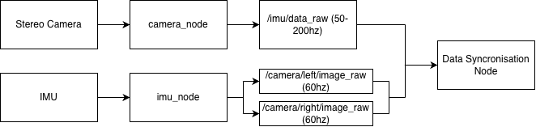

# VIO

A custom build 3D printed RC quadcopter using Visual Inertial Odometry (VIO) to navigate its surroundings.

## What it does
This drone navigates without GPS using Visual-Inertial Odometry (VIO): a downward-facing stereo camera and an IMU are fused onboard a Raspberry Pi 5 to estimate the drone's position and motion in real time. This enables autonomous flight in GPS-denied or GPS-degraded environments such as indoors, warehouses, disaster zones, defence settings, as well as in tasks like infrastructure inspection where navigating relative to the immediate surroundings matters more than global coordinates.

## Hardware
- Sing Board Computer: Raspberry Pi 5 8GB
- AI Accelerator: Raspberry Pi AI Hat+ 13 TOPS
- Flight ControllerL DAKEFPV H743 30x30
- Propellers: Gemfan 8x4x3
- Arms (Carbon Fibre Tube): 3K CF tube OD: 10mm ID: 6mm
- Motors: Anoel 2812 1115KV
- Down Firing Stereo Camera: 1MP OV9281 Global Shutter Binocular Synchronous
- ESC: DAKEFPV 8S 70A BLHeli_S 30x30
- External IMU: BMI088a
- Frame: 3D printed from PLA with design files to be uploaded soon

- Wiring diagram or photo

## How it works
The interesting bit. Architecture in plain English:
sensors → processing → decisions → actuators.
A simple diagram helps a lot.

## Design decisions
- Choice of camera
- Choice of raspberry pi
- Choice of OpenVINS as VIO Pipeline
(Complete all with detail)

## What went wrong
- Early driver code for IMU and Camera nodes was completely AI generated with little to know oversight or understanding of resulting code before it was implemented. When the IMU data became bad it was hard to distinguish whether it was a hardware or software problem. Rewrote/reviewed the driver code until I understood it. New rule: no code goes in that I can't explain.

## Results
Numbers, tables, videos. For the evals-style project this is the
core: conditions tested × success rates.

## What I'd do differently / next steps
Shows you're still thinking. 2–3 bullets.
